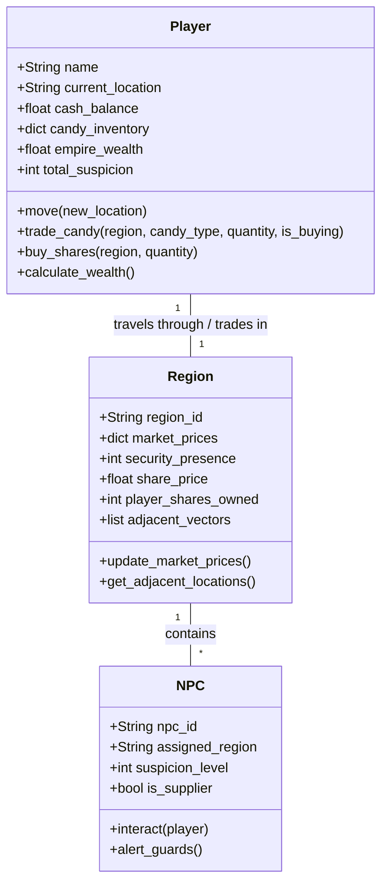

# Class Diagram - Sweet Stash

```mermaid
classDiagram
    class Player {
        +String name
        +String current_location
        +float cash_balance
        +dict candy_inventory
        +float empire_wealth
        +int total_suspicion
        +move(new_location)
        +trade_candy(region, candy_type, quantity, is_buying)
        +buy_shares(region, quantity)
        +calculate_wealth()
    }

    class Region {
        +String region_id
        +dict market_prices
        +int security_presence
        +float share_price
        +int player_shares_owned
        +list adjacent_vectors
        +update_market_prices()
        +get_adjacent_locations()
    }

    class NPC {
        +String npc_id
        +String assigned_region
        +int suspicion_level
        +bool is_supplier
        +interact(player)
        +alert_guards()
    }

    Player "1" -- "1" Region : travels through / trades in
    Region "1" -- "*" NPC : contains
```
